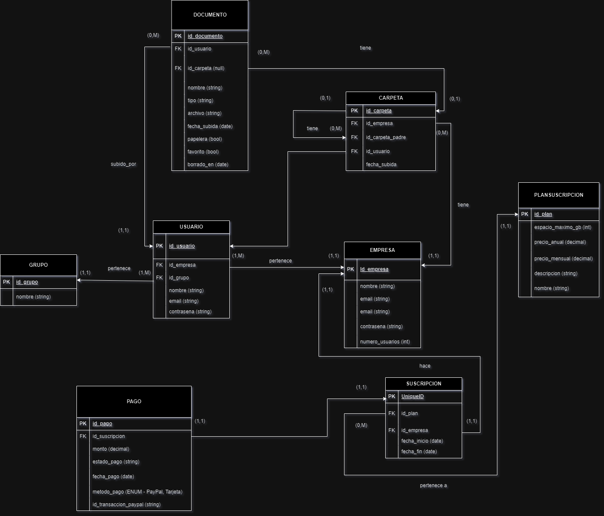

# Papelectro

## Descripción del Proyecto

**Papelectro** es una aplicación web de Gestión Electrónica de Documentos (GED) diseñada para empresas, con el objetivo de optimizar la administración de sus documentos mediante un sistema de almacenamiento digital centralizado. La aplicación busca sustituir el uso tradicional de archivos en papel, facilitando la organización y acceso a la información desde cualquier lugar. Además, se integra con funcionalidades avanzadas como la búsqueda inteligente, la gestión de usuarios con roles y la implementación de pagos por suscripción.

## Funcionalidades Principales

### Almacenamiento y Gestión de Documentos
Papelectro permite a las empresas almacenar diferentes tipos de documentos (`*.txt`, `*.xls`, `.pdf`, ` .jpg`...) de manera segura y accesible en cualquier momento. Los archivos podrán organizarse en carpetas dentro de la plataforma, según el plan de almacenamiento contratado.

### Búsqueda Inteligente
Los usuarios podrán realizar búsquedas avanzadas utilizando palabras clave, categorías o fechas, mejorando la eficiencia en la recuperación de información.

### Gestión de Usuarios y Roles
Se implementarán diferentes niveles de acceso basados en roles, lo que permitirá a los usuarios pertenecer a grupos según su empresa o cargo, con acceso limitado o completo a funciones y documentos.

# Mapa de Navegación de Papelectro

## 1. Pantalla de Inicio / Home
- **Banner de Bienvenida**
  - Texto motivacional y llamado a la acción.
  - Botón: **Descubre más** (enlace a la sección de características).
- **Sección de Características**
  - Funcionalidades principales de la plataforma:
    - **Búsqueda Inteligente**: Filtrado avanzado y por palabra clave.
    - **Planes Personalizados**: Selección de plan de acuerdo a necesidades.
- **Sección CTA (Call to Action)**
  - **Botón de Registro**: Para invitar a nuevos usuarios a crear una cuenta.
- **Pie de Página**
  - Derechos de autor y enlaces legales (Aviso de privacidad, Términos y condiciones).

---

## 2. Mapa de Navegación Principal

1. ### Dashboard
   - **Resumen** de archivos y carpetas.
   - **Acceso directo** a búsqueda, favoritos y papelera.

2. ### Documentos
   - **Mis Documentos**: Visualización de archivos personales.
   - **Favoritos**: Documentos marcados para acceso rápido.

3. ### Búsqueda Inteligente
   - Campo de **búsqueda rápida** disponible en todas las pantallas.
   - **Filtrado avanzado** por nombre, etiquetas o palabras clave.

4. ### Papelera
   - Visualización de **documentos eliminados**.
   - Opciones para **restaurar** o **eliminar permanentemente**.

5. ### Configuración de Cuenta y Suscripción
   - **Cuenta personal**: Actualización de datos personales.
   - **Suscripción**: Configuración y detalles de pago.

6. ### Soporte y Ayuda
   - Guías de uso y preguntas frecuentes.
   - **Contacto**.

---

## Jerarquía de Navegación
La barra de navegación superior contiene accesos directos a las secciones clave:
- **Inicio**, **Documentos**, **Búsqueda**, **Favoritos** y **Papelera**.
- **Botón de Cargar Archivo**: Un botón resaltado para subir documentos rápidamente.

### Planes de Suscripción
Papelectro implementa un modelo de negocio basado en suscripciones, donde las empresas pagarán una cuota  anual para acceder al servicio, con diferentes niveles de almacenamiento y funcionalidades según el plan contratado.

### Seguridad
La seguridad es fundamental en este proyecto. Se implementarán prácticas como el cifrado de datos.

### Simulación de Pago
Se integrará un simulador de pago mediante **PayPal** para gestionar las cuotas de suscripción, permitiendo a las empresas abonar los planes de almacenamiento de manera sencilla y segura.(No he podido)

### Páginas Adicionales
La aplicación contará con una página de inicio, una sección de información sobre el servicio, una página de contacto y una sección para seleccionar los planes de almacenamiento disponibles.

## Justificación del Proyecto

El papel es ineficiente y genera altos costos de almacenamiento físico y riesgo de pérdida de información. Papelectro busca resolver estos problemas, optimizando la gestión de documentos mediante una plataforma segura y eficiente, dirigida a empresas que deseen mejorar su proceso de digitalización.

## Alcance del Proyecto

El proyecto incluye:
- Desarrollo del backend y frontend para la gestión de archivos, usuarios y roles.
- Integración de funcionalidades de seguridad.
- Implementación del sistema de pagos por suscripción con **PayPal**.(NO he podido)
- Funcionalidad de búsqueda avanzada de documentos.
- Escalabilidad para crecer a medida que más empresas se unan al servicio.

El proyecto se centrará en crear un **MVP (Producto Mínimo Viable)** con funcionalidades básicas, seguido de mejoras progresivas en seguridad y optimización de la interfaz.

## Valoración de Alternativas Existentes

### Google Drive y Dropbox
Son plataformas populares para el almacenamiento en la nube, pero **Papelectro** se enfoca en entornos empresariales con roles personalizados y un sistema de búsqueda optimizado para documentos empresariales.

### M-Files y Alfresco
Son sistemas más completos pero costosos. Papelectro ofrece una alternativa accesible y fácil de implementar, dirigida a pequeñas y medianas empresas.

### Evernote y OneNote
Son plataformas de notas que carecen de la gestión de roles y la seguridad avanzada que **Papelectro** implementará.

## Stack Tecnológico Elegido

### Backend:
- **Django**: Framework robusto y seguro para el desarrollo del backend, gestión de usuarios y autenticación.

### Frontend:
- **JS** o **Django Templates**: Dependiendo del nivel de interactividad necesario.
- **Bootstrap**, **CSS**, **HTML**: Para una interfaz responsiva y amigable.

### Base de Datos:
- **SQLite3**: SQLite3 para desarrollo y producción.

### Servidor:
- **PythonAnywhere** 

### JSON:
- Se utilizará para la transferencia de datos entre frontend y backend.

## Objetivos del Proyecto

1. Desarrollar un sistema de almacenamiento de documentos que permita subir, organizar y descargar archivos de diferentes tipos (`*.txt`, `*.pdf`, `*.xls`).
2. Implementar una búsqueda avanzada para localizar documentos por palabras clave, categorías, fecha, etc.
3. Crear un sistema de gestión de usuarios con roles y niveles de acceso diferenciados.
4. Implementar un sistema de suscripción con planes de almacenamiento y pasarela de pago.
5. Garantizar la seguridad mediante cifrado y control de acceso.
6. Desarrollar una interfaz intuitiva y accesible desde cualquier dispositivo.

## Requisitos del Sistema

### Requisitos Funcionales:
- Autenticación de usuarios y gestión de contraseñas.
- Gestión de documentos: subir, descargar y eliminar archivos.
- Roles y permisos de usuario diferenciados (administrador y usuario estándar).
- Suscripciones y pagos mediante **PayPal**.(no he podido)
- Búsqueda avanzada de documentos por filtros y palabras clave.
- Límites de almacenamiento según el plan.

### Requisitos No Funcionales:
- Escalabilidad para manejar un número creciente de usuarios y documentos.
- Cifrado de datos y autenticación segura.
- Disponibilidad del 99.9% del tiempo.
- Rendimiento optimizado (operaciones en menos de 3 segundos).
- Compatibilidad con diferentes navegadores y dispositivos.
- Mantenimiento y actualización sin interrupciones.

### Requisitos de Interfaz:
- Diseño responsivo.
- Interfaz minimalista e intuitiva.
- Dashboard para gestionar almacenamiento y documentos.
- Notificaciones y alertas claras.
- Sistema de ayuda y FAQ.

## Casos de Uso Importantes

### Caso de Uso 1: Subir un Documento
**Descripción**: El usuario sube un archivo para almacenarlo.
- **Actor**: Usuario (administrador o estándar).
- **Flujo**: Acceder a la sección de documentos > Seleccionar archivo > Subir.

### Caso de Uso 2: Buscar un Documento
**Descripción**: El usuario realiza una búsqueda avanzada.
- **Actor**: Usuario.
- **Flujo**: Acceder a búsqueda avanzada > Introducir criterios > Ver resultados.

### Caso de Uso 3: Pago de Suscripción
**Descripción**: El administrador renueva la suscripción.
- **Actor**: Administrador.
- **Flujo**: Seleccionar plan > Realizar pago vía PayPal > Confirmación.

### Caso de Uso 4: Gestión de Roles y Permisos (No he podido del todo )
**Descripción**: El administrador gestiona los permisos de usuarios.
- **Actor**: Administrador.
- **Flujo**: Acceder a gestión de usuarios > Asignar permisos/roles > Guardar cambios.

  
## Diagrama inicial entidad relación

# Identidad Corporativa de Papelectro

### Logotipo
Para Papelectro, se ha optado por un diseño **sin logotipo**. Esto aporta una imagen más minimalista, profesional y moderna, coherente con una aplicación de gestión documental enfocada en la eficiencia y simplicidad.

En lugar de un logo tradicional, el nombre **"Papelectro"** en una tipografía clara y elegante, como **Mitr** en mayúsculas, servirá como identificador visual. Esto aparecerá en la cabecera y en otros elementos de la interfaz, ofreciendo un aspecto visual limpio y profesional.

### Justificación
El diseño sin logotipo permite:
- Un **aspecto visual más limpio y ligero**, eliminando distracciones.
- Centrar la atención del usuario en las funcionalidades esenciales de la aplicación.
- Facilitar la adaptación a diferentes tamaños de pantalla, manteniendo la marca visible y reconocible.

Este enfoque es ideal para la imagen de **Papelectro** como herramienta moderna y eficiente para la gestión de documentos empresariales.

### Iconografía

Utilizaré iconos de funcionalidades (como búsqueda, descarga y almacenamiento) en un **estilo minimalista lineal**, lo cual refuerza la simplicidad y limpieza visual del diseño de Papelectro. Este estilo garantiza que los iconos se integren armoniosamente en la interfaz sin desviar la atención de la funcionalidad principal.

Para mantener una apariencia coherente y profesional, he preferido **iconos monocromáticos** en el color principal de la marca o en blanco. Esto aporta un aspecto uniforme que complementa el diseño general y respalda la identidad visual de la aplicación.

Están en la carpeta static/icons

### 2. Tipografía Corporativa

- **Fuente Principal**: La fuente **Mitr** es ideal para los títulos y subtítulos, aportando un toque moderno y profesional que refuerza la imagen de tecnología y claridad que quiere transmitir Papelectro.

- **Fuente Secundaria**: **Roboto** se utiliza para el cuerpo del texto y descripciones, por su versatilidad y excelente legibilidad en pantalla.

#### Jerarquía:
- **Títulos**: Mitr, tamaño 32-40px.
- **Subtítulos**: Mitr, tamaño 24-30px.
- **Texto Normal**: Roboto, tamaño 16px.

### Esquema de Colores

Los colores elegidos reflejan profesionalismo, tecnología y accesibilidad, y cuidado del medio ambiente logrando una paleta limpia y moderna que apoya la funcionalidad y usabilidad de Papelectro:

- **Color principal:** Verde claro (#2ecc71), aplicado en encabezados y botones destacados, dando una sensación de frescura y fiabilidad.
- **Color de acción:** Azul claro (#3498db) para botones clave como "Registrarse" o "Descubre más", incentivando la interacción y manteniendo un enfoque en la acción.
- **Color secundario:** Gris oscuro (#34495e) para el texto, asegurando una excelente legibilidad y contraste.
- **Color de fondo:** Blanco (#ffffff) y gris claro (#f4f4f4) para los elementos de fondo, proporcionando una base limpia y sencilla que enfoca la atención en el contenido y las funcionalidades principales.

  ### Estilo General del Diseño

Para Papelectro, el diseño se centra en una estética limpia y minimalista, que prioriza funcionalidad y claridad en cada elemento visual:

- **Estilo Visual:** Adoptamos un diseño minimalista que elimina distracciones y enfatiza la facilidad de uso. La simplicidad y el enfoque en lo esencial brindan una apariencia profesional, alineada con los valores tecnológicos de la aplicación.

- **Botones:** Los botones tienen un estilo redondeado y un grosor mediano, facilitando la interacción táctil y visual. El color principal del botón varía según la acción:
  - **Azul claro**: Se utiliza para los botones informativos, proporcionando un tono suave que invita a explorar.
  - **Verde claro**: Dedicado a las acciones de registro o compra, este color destaca entre los demás, guiando de forma intuitiva hacia las interacciones clave.

- **Banners y Secciones:** Los banners son visualmente llamativos, con un texto central y claro que invita a interactuar. Se usará fondos en tonos claros para mantener la limpieza visual, acompañados de sombras suaves o bordes definidos en las secciones, que aportan un toque profesional sin sobrecargar el diseño.

Este estilo unificado asegura que los usuarios encuentren la experiencia intuitiva y atractiva, ayudando a consolidar la identidad corporativa de Papelectro.

### Uso de Espacios y Diseño Responsivo

Para Papelectro, es fundamental que la experiencia del usuario sea fluida y agradable en cualquier dispositivo. Para lograr esto, se implementarán las siguientes estrategias:

- **Margen:** Se mantendrán márgenes amplios en las secciones principales para proporcionar un espacio adecuado alrededor del contenido. Esto no solo mejora la estética visual, sino que también evita la saturación de información, permitiendo que los usuarios se concentren en lo que es realmente importante.

- **Diseño Adaptativo:** Se utilizarán frameworks como Bootstrap o CSS Grid para garantizar que el diseño sea responsivo y se adapte a todos los tamaños de pantalla. Este enfoque permitirá que los usuarios accedan a Papelectro sin importar el dispositivo que utilicen, desde smartphones hasta pantallas de escritorio, asegurando que la funcionalidad y la presentación visual se mantengan consistentes.

Con estos principios, Papelectro ofrecerá una interfaz intuitiva y accesible que prioriza la comodidad del usuario, facilitando la gestión documental en un entorno digital dinámico.

---

**Retos en el Desarrollo de Papelectro**

1. **Gestión de Usuarios y Roles**: Implementar la gestión de usuarios y la asignación de roles en Django ha sido un desafío. Aunque se ha avanzado en la integración de la autenticación y la creación de roles, la asignación de permisos personalizados y la correcta configuración de accesos según el rol del usuario no se ha podido realizar por completo. A pesar de los intentos, algunos aspectos del control de acceso y la administración de usuarios aún requieren ajustes adicionales para asegurar una experiencia fluida y segura.

2. **Integración de Pagos con PayPal**: La integración de un sistema de pagos por suscripción mediante PayPal ha resultado ser particularmente difícil. La implementación de las pasarelas de pago, la validación de las transacciones y la configuración del modelo de suscripción no han sido tareas fáciles, y aún no se ha logrado una integración completamente funcional que permita procesar pagos de manera eficiente.

3. **Almacenamiento Seguro de Documentos**: Aunque se tiene la intención de implementar almacenamiento seguro para los documentos, no se ha podido avanzar en la práctica con la implementación de técnicas adecuadas de cifrado y almacenamiento seguro de archivos. Las opciones de almacenamiento como Amazon S3 y su integración en Django requieren un nivel de conocimiento y experiencia que aún no se ha alcanzado completamente, lo que ha dificultado su implementación efectiva.

4. **Equilibrar los Tiempos de Desarrollo**: Dado que el proyecto se está desarrollando de manera iterativa, equilibrar los tiempos de desarrollo ha sido un reto constante. Ajustar plazos y prioridades es especialmente complejo cuando surgen imprevistos o cuando se presentan nuevos requisitos que alteran el plan de trabajo inicial. La dificultad para estimar con precisión el tiempo necesario para implementar algunas características ha generado algunos retrasos y ha complicado la planificación del proyecto.

---

